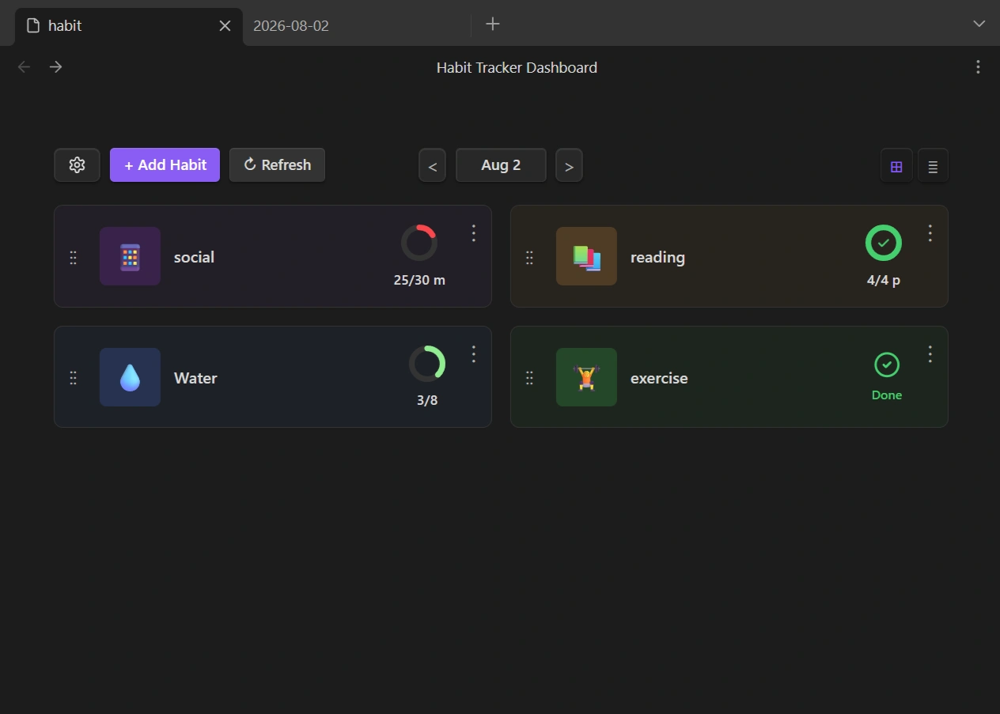
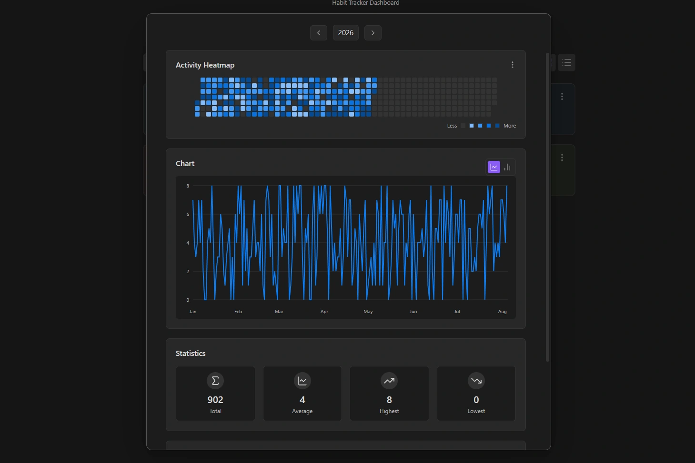
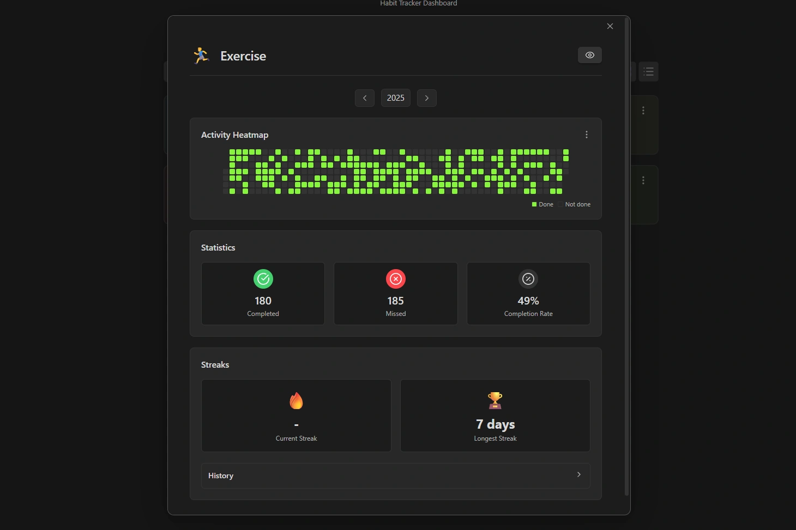
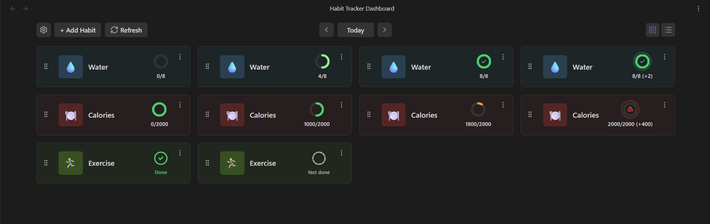

English | [فارسی](README-FA.md)

# Habit Tracker Dashboard

<div align="center">
  
  
  
</div>

This plugin reads habit data from your note properties and displays it through visual dashboards.


## Features

- 📅 **Daily Dashboard**: Track your daily habits, view completion status, and navigate through previous days.

- 🔥 **Heatmap Calendar**: Visualize your habit activity throughout the year with a GitHub-style contribution calendar.

- 📈 **Line and Bar Charts**: Analyze habit trends and progress over time with interactive charts.

- 📊 **Detailed Statistics**: View total counts, averages, maximum and minimum values, and completion rates.

- 🔗 **Habit Streak Tracking**: Monitor current streaks, longest streaks, and streak history.

<br>

## Usage

### 1. Add Habit Data to Your Daily Notes

First, record your habits in the properties of your daily notes.

```yaml
---
exercise: true
reading: 30
---
```

### 2. Create a dashboard

Click the plugin icon in the ribbon, or run **"Habit Tracker Dashboard: Create new habit tracker"** from the Command Palette.

Enter a name for your dashboard file and click **Create**.

### 3. Configure the Data Source

Open **Tracker Settings (⚙️)** and choose:

- Where your daily notes are located (Tag or Folder)
- How dates should be extracted (File name or Frontmatter)

> ⚠️ Dates must use the Gregorian format (YYYY-MM-DD) for the selected date source. e.g. 2026-05-08

### 4. Create Your Habits

Click **Add Habit** and enter your habit information.

Choose the habit type based on the property type in your daily notes:

- **Boolean**: For habits with checkbox properties. e.g. Exercise
- **Numeric**: For habits with number properties. e.g. Reading

You can customize options such as target values, units, and visualization settings for numeric habits.


That's it! The dashboard will automatically read your daily notes.


## Settings & Behavior

### Visualization Modes



#### Boolean Habits

Boolean habits have a simple two-state visualization:

* Completed: A checked icon is displayed.
* Not completed: A circle icon without a check mark is displayed.

#### Numeric Habits - At Least Mode

In this mode, higher values are better.
For example, if the goal is to drink 8 glasses of water per day:

* 0 value: The donut chart is empty.
* 4 value: Half of the donut chart is filled.
* 8 value: The donut chart is complete and a check mark appears inside the circle.
* Above 8: An additional ring appears around the donut, and the extra amount is displayed as (+2).

#### Numeric Habits - At Most Mode

In this mode, lower values are better. It works exactly opposite to the At Least mode.
For example, if the goal is to control daily calorie intake for weight loss, with a maximum target of 2000 calories:

* 0 value: The donut chart is completely filled because no calories have been consumed yet.
* As the value increases: The donut chart gradually empties and its color shifts toward red.
* Reaching 2000: The donut chart becomes completely empty.
* Above 2000: A warning ring appears around the donut and the ⚠️ icon is displayed.


### Refresh

To improve performance and avoid continuously scanning files, the plugin stores habit data in a temporary cache.

If you manually edit your daily notes, click **Refresh (🔄)** to re-scan the files and update the dashboard with the latest changes.


### Completion Condition

For **numeric habits**, choose when a habit is considered completed:

- **At least** (≥): Reach or exceed the target (e.g. 30+ minutes)
- **At most** (≤): Stay at or below the target (e.g. ≤2000 calories)
- **Exactly** (=): Match the target exactly

### Grace Days

Allow a streak to continue after a limited number of consecutive missed days.

- **0** = No missed days allowed; the streak resets immediately.
- **1+** = Allow the specified number of missed days before the streak resets.


### Minimum Streak Length

Only streaks with at least this many days are shown in **Streak History**.